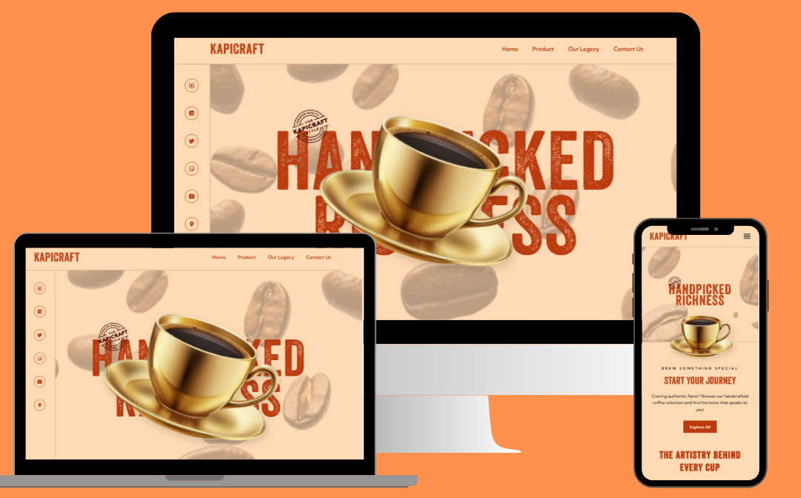

# ☕ Coffee House (Frontend-project)
A handcrafted frontend experience built with GSAP ScrollTrigger, featuring scroll-driven animations, pin-based transitions and a fully responsive retro-modern layout. Designed with care to deliver smooth immersive storytelling through clean modern code. It’s fun, responsive and brewed just right for today’s web.

[ Click here for live demo ](https://coffee-house-frontend-project.vercel.app/)

---

## 🖼️ Preview



---

## 🔥 Features

- 🎯 **Scroll-based animations** using GSAP ScrollTrigger  
- 📱 **Fully responsive** layout optimized for desktop and mobile  
- 🧭 **Smooth navigation** with scroll snapping and section anchoring  
- 🖋 **Custom fonts and typography** for an old-school vibe  
- 🌄 **Hero section with animated coffee cup & stamp**  
- 🧩 Modular CSS for maintainable styles  
- 📜 Built for **frontend storytelling and UI portfolio projects**

---

## 📁 Folder Structure

```
coffee-house/
│
├── index.html
├── style.css
├── main.js
├── /assets
|   ├── images
│       ├── heroimg.png
│       ├── image.png
│       ├── stamp.png
│   └── veneer.woff
└── README.md
```

---

## 💡 Inspiration

This project is inspired by South India's rich coffee heritage. The design pays homage to vintage filter coffee, tumbler sets and legacy brewing traditions, while blending it with modern animation techniques.

---

## 🧰 Tech Stack

- **HTML5** & **CSS3**
- **JavaScript (ES6)**
- **GSAP** + **ScrollTrigger**
- **Responsive Design** with media queries
- **Custom Fonts** (`Veneer`, `Rubik Dirt`)
- **Git & GitHub** for version control

---

## 🚀 Getting Started

1. Clone the repository:

```bash
git clone https://github.com/HariPriya-hub01/Coffee-House---Frontend-project.git
cd coffee-house
```

2. Open `index.html` in your browser or use a live server (recommended with VS Code).

---

## 🛠️ Available Scripts

No build tools required. This is a static frontend project.

You can preview using:

- **Live Server** extension in VS Code  
- OR deploy using **Netlify**, **Vercel**, or **GitHub Pages**

---

## 🎯 Roadmap / TODO

- [x] Add responsive layout  
- [x] Integrate GSAP ScrollTrigger  
- [x] Create ingredients and timeline sections  
- [x] Finalize typography and color scheme  
- [ ] Add dark mode toggle 🌙  
- [ ] Add contact form 📬  
- [ ] Optimize images for performance  

---

## 👩‍💻 Author

**Hari Priya R**  
Frontend Developer | Portfolio Builder | Coffee Aficionado ☕  
[LinkedIn](https://www.linkedin.com/in/haripriyaradhakrishnan/) · [GitHub](https://github.com/HariPriya-hub01)

---

## ❤️ Acknowledgments

- [GSAP ScrollTrigger](https://greensock.com/scrolltrigger/)
- [Fonts from Google Fonts](https://fonts.google.com/)
- Icon SVGs from [Lucide](https://lucide.dev/) and [Heroicons](https://heroicons.com/)

---

## 📜 License

This project is for personal/educational use. Feel free to fork, modify, or showcase in your portfolio!
Check MIT license for more info.

---

> Made with ❤️ by Hari Priya

